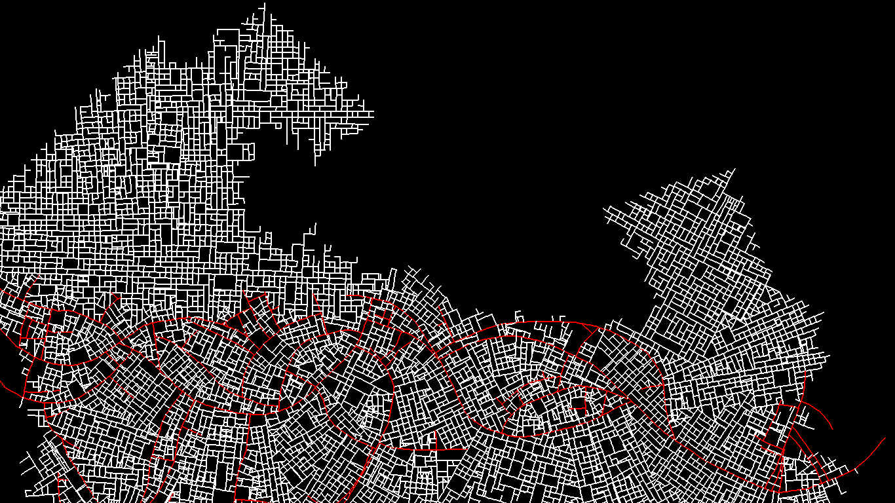

# City Generator
This is a script that creates procedural city maps.

# About
This was originally inspired by Introversion Software's city generator, and based on 
[this paper by Parish & Müller](https://graphics.ethz.ch/Downloads/Publications/Papers/2001/p_Par01.pdf)
as well as [this implementation](https://www.tmwhere.com/city_generation.html) of the algorithm in that paper.

# Usage
To run, the only package required is `noise`

## Keybindings
Select roads with mouse 1, zoom in and out with the scroll wheel

**g** - Generate the city

**z** - Mark the start of a path (the road closest to the cursor)

**x** - Mark the end of a path

**c** - Find the shortest path between the two points (A*)

**v** - Find the shortest path (Dijkstra)

### Debug Visualization
**1** - Show/hide general info about the city, current cursor point, & selected road

**2** - Cycle through showing the different types of snaps roads have made and whether or not each road is a branch

**3** - Show/hide the ID of each road

**4** - Show/hide the population heatmap

**5** - Show/hide sector borders

**6** - Isolate the roads that are in or near the sector of the selected road

**7** - Show the roads that are in the sector the mouse is in
